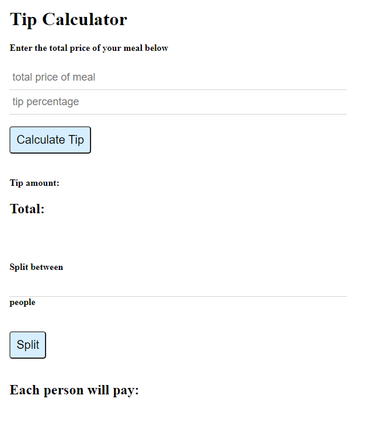

# tip_calculator

This project is built so that I may practice selecting from html specific elements and utilizing functions to enable tip calculations.

## Link to the site

https://codragon2020.github.io/tip_calculator/

This site was made with:

## Screenshot of app

